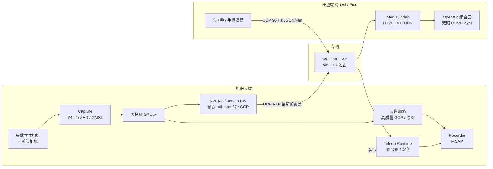
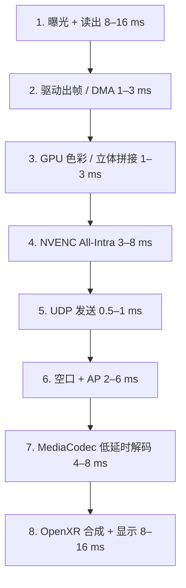
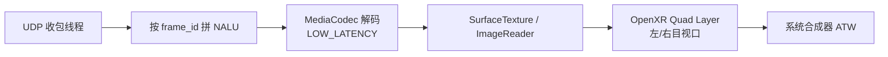

# 机器人 Quest / Pico VR 低延时数据采集实现方案

本文给出一套可落地的端到端方案：操作员佩戴 **Meta Quest 3 / 3S** 或 **PICO 4 Ultra / 4 Enterprise**，通过机器人头部立体相机观察现场，用手持手柄 / 手部追踪遥操作机器人，并同步落盘演示数据，供模仿学习与 VLA 微调使用。

核心约束：**机器人相机曝光完成 → 头盔双眼画面呈现完成（photon-to-photon）目标 ≤ 50 ms，验收上限 80 ms**。控制上行（姿态 → 关节指令）独立走低负载 UDP，不与预览码流争抢同一条可靠传输通道。

对标基线：Open-TeleVision（ZED Mini → Quest 3）约 **121 ms**；XRoboToolkit（ZED Mini → PICO 4 Ultra）约 **82 ms**（1280×720@60、1 Mbps、同网）。本方案通过「预览/录像双通路、硬件编解码、最新帧覆盖、Surface 零拷贝上屏」把预览链路压到 50 ms 量级。

---

## 1. 目标、范围与非目标

### 1.1 必须达成

| 项 | 指标 |
| --- | --- |
| 预览延时 | 相机光子 → 头盔像素 **P50 ≤ 50 ms，P95 ≤ 80 ms** |
| 预览规格 | 双眼各 **1280×720 ~ 1920×1080**，**60–90 fps**，立体视差正确 |
| 控制频率 | 头/手柄姿态 **90 Hz**；手关节 **60 Hz**；下发关节 **200–500 Hz**（机器人实时环） |
| 设备 | Quest 3 / 3S 与 Pico 4 Ultra 共用同一套协议与数据格式 |
| 采集 | 一次演示同时记录：立体头视、腕部相机、关节状态、指令、XR 姿态、任务标签 |
| 导出 | 原始 **MCAP** + 训练用 **LeRobot v2 / HDF5** |
| 安全 | 急停、工作空间盒、速度限幅、丢包超时回零 |

### 1.2 非目标（本方案不优先）

- 公网 / 跨城遥操作（WebRTC TURN 会额外加 50–200 ms）
- 云端渲染、云 XR（CloudXR）
- 完整人形全身重定向量产（可作为二期）
- 在 Zygisk / 游戏进程内挂钩画面（与本方案无关，也不应混用）

---

## 2. 总体架构

系统拆成四层，预览视频与采集落盘在机器人端分叉，互不阻塞。



设计原则：

1. **预览与录像分离**。预览只服务操作员观感；录像走另一条编码器或直写原图，不因落盘拖慢预览。
2. **不可靠、可丢、只留最新帧**。预览禁止 TCP / 可靠重传 / 大 jitter buffer。
3. **GPU → 编码器 → 网卡 → 解码器 → Surface → OpenXR Layer** 全程避免 CPU `memcpy` 和 Unity `Texture2D.LoadRawTextureData`。
4. **Quest / Pico 共用 OpenXR + 同一套线协议**；厂商 SDK 只做追踪增强与权限，不分裂视频栈。
5. **机器人实时控制不经过头盔 App**。头盔只上报位姿；IK、限幅、急停在机器人实时进程完成。

### 2.1 进程与部署拓扑

推荐三机，也可两机（头盔直连机器人）：

| 节点 | 硬件建议 | 进程 |
| --- | --- | --- |
| 机器人车载 / 机载算力 | Jetson Orin NX/AGX，或工控机 + RTX 4060 及以上 | `capture_node` `encode_preview` `encode_record` `teleop_runtime` `recorder` |
| 现场交换机 / AP | Wi-Fi 6/6E 企业 AP，头盔与机器人同一 VLAN，关闭客户端隔离 | 仅转发 |
| 头盔 | Quest 3 或 Pico 4 Ultra，开发者模式 | Unity OpenXR App：解码、上屏、追踪上报、采集按钮 |
| 可选督导机 | 笔记本 | 任务标注 UI、延时看板、急停手柄；**不在预览热路径上** |

最低延时拓扑：**机器人网口 → 有线到 AP → 头盔 5/6 GHz**。不要经过办公 NAT、不要走 USB 调试桥、不要经 PC 再转一层 Web 服务（这是 Open-TeleVision / Vuer 偏慢的主因之一）。

---

## 3. 硬件选型

### 3.1 头部立体相机（预览主相机）

优先级从高到低：

| 方案 | 优点 | 注意 |
| --- | --- | --- |
| 工业双目（全局快门，GMSL / USB3，基线 6–7 cm） | 曝光短、无卷帘、延时下限最低 | 需要标定与同步触发 |
| ZED Mini / ZED X | SDK 成熟、立体质量稳 | 须在外置 GPU 上取流再自建编码，勿走 ZED 自带高延时预览 |
| RealSense D455 / D405（腕部） | 腕视便宜 | 卷帘快门，不适合当头视主预览 |
| 把 Pico 4 Ultra 固定在机器人头上当相机 | 色彩/动态范围好，XRoboToolkit 验证过 2160×810@60 | 占一台头盔；预览约 100 ms，不如外置 GPU 编码路径 |

**必须用全局快门做头视**。卷帘快门在快速转头时产生倾斜畸变，操作员会误判接触点。

同步：左右目硬件 trigger 同源；腕部相机用同一 PTP / `timerfd` 时间域打戳，精度目标 **< 1 ms**。

主动头部：2-DoF 云台（yaw + pitch）跟随头盔，**不要跟 roll**，避免视觉-前庭冲突引起晕动症。

### 3.2 网络

| 项 | 要求 |
| --- | --- |
| 频段 | 5 GHz 或 6 GHz，独占信道，40/80 MHz |
| 协议 | 头盔连 AP，机器人 **有线进 AP**（避免双无线跳） |
| QoS | 预览 UDP DSCP EF；控制 UDP 更高优先；录像走有线或后处理，不占无线 |
| 码率预算 | 双眼预览合计 **20–40 Mbps**（远高于 1 Mbps 演示配置，画质和延时都更好） |
| 禁 | 客户端隔离、组播转单播代理、深度包检测、USB 无线网卡共享 |

无线 hop 每多一跳大约 +5–15 ms 抖动。验收环境必须固定 AP 与信道。

### 3.3 头盔

- **Quest 3 / 3S**：OpenXR + Meta XR SDK；手柄 + 手追；无官方全身/物体追踪器。
- **Pico 4 Ultra / Enterprise**：OpenXR + Pico SDK；手柄 + 手追 + 全身 24 关节 + Motion Tracker（肘部冗余约束）。
- 双眼合成层使用 **OpenXR Composition Quad/Projection Layer**，由合成器直接取样解码 Surface，减少 App 多渲染一帧。

---

## 4. 低延时预览链路（本方案最关键）

从传感器到光子，拆成可独立优化的八段。每段都给出预算、实现要点和禁止事项。



### 4.1 延时预算

| 段 | 目标 | 上限 | 做法 |
| --- | --- | --- | --- |
| 曝光+读出 | 8 ms | 16 ms | 全局快门、短曝光、固定 60/90 fps，关自动曝光猎振 |
| 驱动出帧 | 2 ms | 4 ms | V4L2 `DMABUF`，不经 OpenCV `Mat` 拷贝 |
| GPU 预处理 | 2 ms | 4 ms | CUDA/NvBufSurface 原地：去畸变 LUT、YUV、左右拼接 |
| 编码 | 5 ms | 8 ms | NVENC / NVV4L2；`zerolatency`；GOP=1 或 intra-refresh |
| 组包发送 | 1 ms | 2 ms | 用户态 UDP，超大帧切 RTP，禁 Nagle（本就 UDP） |
| 空口 | 4 ms | 8 ms | 有线进 AP + 5/6 GHz；码率稳定，避免瞬时突发超信道 |
| 解码 | 6 ms | 10 ms | `MediaCodec` + `PARAMETER_KEY_LOW_LATENCY=1`，输出到 Surface |
| 上屏 | 11 ms | 16 ms | 解码 Surface 直接挂 OpenXR Layer；App 90/120 Hz |
| **合计** | **~39 ms** | **~68 ms** | P95 预留抖动，验收线 80 ms |

### 4.2 编码参数（预览）

预览不是存档。优先「每一帧独立可解」，牺牲压缩率换延时。

| 参数 | 推荐 | 原因 |
| --- | --- | --- |
| 编码 | H.264 High（头盔解码器最稳） | Quest/Pico 对 HEVC 低延时档支持不一致 |
| 分辨率 | 左右并排 2560×720 或双流各 1280×720 | 单解码器少一次同步；双流可并行 |
| 帧率 | 与相机锁定 60 或 90 | 不插帧、不丢中间再补 |
| GOP | **1（All-Intra）** 或 15 + intra-refresh | 丢包不级联花屏，无需等关键帧 |
| B 帧 | **0** | B 帧强制重排，+1–2 帧延时 |
| 码控 | CBR 25–40 Mbps 合计 | 1 Mbps 会迫使编码器看很多帧做率失真 |
| 预设 | `llhp` / `zerolatency` / `tune=zerolatency` | 关 lookahead、关 psychovisual 多帧 |
| 输入 | NV12 Dmabuf | 避免 RGB→CPU→YUV |
| 色彩 | BT.709 limited，写进 SPS | 头盔端不再做错误色彩转换 |

Jetson 上优先 `nvv4l2h264enc` + `maxperf-enable=1` + `iframeinterval=1` + `insert-sps-pps=1`。x86 上用 NVENC `preset p1` + `tune ull` + `rc=cbr` + `gop=1`。

LAN 极短距、算力足够时，可用 **TurboJPEG 90 质量 + UDP** 替代 H.264（编码 <2 ms）。无线 20 Mbps 以上仍建议 H.264，避免突发丢包把 JPEG 大包打烂。

### 4.3 传输：最新帧覆盖 UDP/RTP

自定义轻量协议（详见 [protocol.md](./protocol.md)）：

- 媒体：RTP over UDP，payload H.264 AVCC/AnnexB，MTU 1200。
- 接收端 **按 `frame_id` 聚合**；某帧缺片且下一帧已开始 → **整帧丢弃**。
- 接收队列深度 **1**（正在拼的一帧 + 正在解的一帧），禁止 200 ms jitter buffer。
- 不启 FEC 重传（ARQ 会把旧帧塞回热路径）。高丢包时降分辨率或降到 60 fps，不加大缓冲。
- 发送端若编码快于空口：**丢掉未发出的旧帧，只发最新编码帧**。
- 控制面与媒体面分端口：`udp/50020` 视频，`udp/50021` 追踪，`udp/50022` 会话/心跳。

**不要用**：TCP 文件流、RTSP+TCP interleaved、WebSocket 传 JPEG、Unity `UnityWebRequest` 拉 MJPEG、默认 WebRTC（无低延时调参时 jitter + NACK 轻易 +50 ms）。若必须穿透 NAT，再用 WebRTC，但须：`jitterBufferTarget=0`、关闭 NACK/PLI 等待、强制 H.264 无 B 帧。本方案默认 **同网直连**。

### 4.4 头盔解码与渲染



要点：

1. 解码输出 **直接进 Surface**，不要 `ByteBuffer` 回读再 `LoadRawTextureData`。
2. 打开 `MediaFormat.KEY_LOW_LATENCY` / `PARAMETER_KEY_LOW_LATENCY`，关解码器多帧缓冲。
3. 左右目：并排流用一个解码器 + shader 切视口；双流用两个解码器，按 `capture_ts` 配对，配对窗口 **8 ms**，超时单目重复上一帧。
4. 立体：在 shader 里设 IPD 与会聚距离（建议工作距 **1.0 m**，XRoboToolkit 经验约 3.3 ft）。远距深度可牺牲。
5. 头显姿态预测由 OpenXR 合成器做 TimeWarp。**视频内容本身不要做异步空间扭曲贴到错误深度**，否则手眼不一致。若延时仍 >80 ms，只对背景做低强度 ATW，近处操作面保持源图像。
6. Unity 主线程只负责：提交 Layer、读追踪、发 UDP。收包与送解码在 **Android 原生插件**（C++/Java）完成。

### 4.5 相机端禁止事项

- OpenCV `VideoCapture` → `imencode('.jpg')` → ZeroMQ → Python 头盔端（典型 120–200 ms）。
- 在 ROS 2 里用 `sensor_msgs/Image` 原始 RGB 过 DDS 再编码（拷贝与序列化过重）。预览应在 capture 进程内完成编码。
- 自动白平衡/自动曝光每帧大变；改为锁定或慢速收敛，避免码率尖峰。
- 预览分辨率跟录像 4K 绑死。录像可以 4K 后处理，预览必须独立降尺度。

---

## 5. 追踪、控制与安全

### 5.1 坐标系

全链路采用 **OpenXR 右手系**：X 右、Y 上、Z 后。机器人 URDF 在 `teleop_runtime` 内一次变换到机器人基座。

位姿线格式：`[x, y, z, qx, qy, qz, qw]`，与 XRoboToolkit 对齐，便于两套工具互导数据。

会话原点：App 启动（或操作员按「重置原点」）时的头部位姿。相对运动：按下 grip 瞬间记录控制器与末端的偏移，之后只跟相对位移，避免绝对坐标跳变。

### 5.2 控制映射

| 输入 | 映射 |
| --- | --- |
| 头 6-DoF | 2-DoF 云台 yaw/pitch；限速、限加速度 |
| 左右手柄位姿 | 双臂末端；grip 按下才跟随 |
| trigger | 夹爪开合 0–1 |
| 左摇杆 XY / 右摇杆 X | 全向底盘 vx, vy, ω |
| A/X | 开始 / 暂停采集 |
| B/Y | 标记失败 / 撤销本段 |
| Menu | 软急停（指令回零 + 刹车） |
| 手追 26 关节 | 灵巧手重定向（`dex_retargeting` 一类 QP） |
| Pico Motion Tracker（肘） | 7-DoF 臂零空间约束，人形姿态 |

IK 用 **QP**（Pinocchio + PlaCo 或同等）：末端任务 + 可操作度正则 + 关节盒约束 + 速度盒。奇异附近自动降权，避免抖动污染数据集。

### 5.3 安全状态机

```
IDLE → STREAMING → ARMED → TELEOP → (RECORDING)
                 ↘ ESTOP / HOLD
```

- 追踪丢失、控制包间隔 **> 50 ms**、视频心跳 **> 100 ms**：进入 HOLD，关节速度线性刹到 0。
- 硬件急停（底座按钮 / 督导机空格）切断指令，优先于一切软件状态。
- 工作空间盒与自碰检测在 1 kHz 控制环，不在 Unity 里做。

---

## 6. 数据采集

### 6.1 双通路

| 通路 | 内容 | 频率 | 介质 |
| --- | --- | --- | --- |
| 预览 | 头视立体 H.264 | 60/90 | 无线 UDP，不落盘或只记统计 |
| 记录-视觉 | 头视左右原图或高质量 HEVC、腕部 RGB/深度 | 30–60 | 本机 NVMe，MCAP |
| 记录-本体 | q, dq, τ, ee_pose, cmd | 100–200 | MCAP |
| 记录-XR | 头/手/手柄/全身关节 | 90 | MCAP（头盔时间戳 + 机器人收包时间戳） |
| 记录-事件 | 任务文本、成功/失败、干预、急停 | 事件 | MCAP + JSON sidecar |

所有消息带 **三套时间**：传感器硬件时、机器人 `CLOCK_MONOTONIC`、可选 PTP 全局时。训练对齐以机器人单调钟为轴，XR 用收包时刻 + 发送端 stamp 做偏移估计。

### 6.2 落盘格式

原始会话：**MCAP**（Foxglove / ROS 2 生态，随机访问好）。

训练导出：

1. **LeRobot v2**：`data/*.parquet` + `videos/*.mp4` + `meta/`，对接 π0 / GR00T / 开源 VLA。
2. **HDF5（ALOHA 风格）**：`observations/qpos`、`observations/images/*`、`action`，便于旧栈。

一集目录示例：

```
sessions/20260907_t01_fold/
  session.mcap
  session.json          # 设备、标定、操作员、任务
  calib/
    head_stereo.yaml
    wrist_left.yaml
  export/
    lerobot/
    hdf5/episode_000.hdf5
```

字段级 schema 见 [dataset.md](./dataset.md)。

### 6.3 采集操作流

1. 督导机创建任务（自然语言指令 + 场景 ID）。
2. 头盔看到预览，操作员按 A 开始；LED / 耳机短音确认。
3. 运行中可按 Y 打「失败」标签，该段默认不进训练集。
4. 再按 A 结束；自动切出 0.3 s 预滚动，避免松手噪声。
5. 当场抽帧质检：曝光、同步差、丢包率、IK 超限次数。不达标标记 `qa=reject`。

---

## 7. Quest 与 Pico 统一客户端

```
xr_client/
  Runtime/          C#：会话、UI、OpenXR Layer 提交
  Plugins/Android/  C++：UDP、组帧、MediaCodec
  Tracking/
    OpenXRTrackers  头、手柄、手（两端共用）
    PicoBodyAddon   全身 + Motion Tracker（Pico 条件编译）
    QuestHandsAddon  Meta 手追增强（可选）
  Stereo/
    SideBySide.shader
    Convergence.cs
```

编译产物两个：`com.company.teleop.quest`、`com.company.teleop.pico`。协议、UI、采集键位完全一致。差异用 `UNITY_ANDROID && XR_META / XR_PICO` 隔离。

Pico 独有数据（24 身体系、tracker SN）在 JSON 里作为可选字段，Quest 端填空。机器人侧按字段有无启用肘约束。

---

## 8. 软件模块与仓库建议

本方案建议独立仓库（或 monorepo），不要塞进游戏 dump / Zygisk 工程。

```
robot-xr-teleop/
  proto/                 线协议与 schema
  robot/
    capture/             V4L2/ZED → Dmabuf
    preview_encoder/     NVENC 预览
    record_encoder/      高质量录像
    teleop_runtime/      IK、安全、驱动适配
    recorder/            MCAP writer
    adapters/            ur5 / arx / g1 / ...
  xr_client/             Unity OpenXR
  supervisor/            任务看板、延时探针
  tools/
    mtp_measure/         光子到光子测量
    mcap_to_lerobot/
    mcap_to_hdf5/
  configs/               相机、编码、机器人 URDF
```

运行时图（ROS 2 可选）：`teleop_runtime` 与 `preview_encoder` **不要**用大图像话题互联。二者共享 `cudaipc` / NvSci / 环形 Dmabuf。ROS 2 只承担状态、TF、急停、督导。

---

## 9. 实施阶段

### 阶段 A — 预览延时闭环（先证明 50–80 ms）

1. 工装：全局快门双目 + Orin/PC + 企业 AP + 一台 Quest 或 Pico。
2. 跑通 [latency-pipeline.md](./latency-pipeline.md) 的 GStreamer / NVENC 发送与原生解码插件。
3. 用 LED 面板法测 MTP（见第 10 节），没有 UI、没有 IK。
4. 出门条：P50 ≤ 50 ms 或书面说明瓶颈段。

### 阶段 B — 追踪与单臂遥操作

1. 头盔上报头/手柄 90 Hz。
2. 单臂 QP-IK + grip 相对跟随 + 工作空间盒。
3. 云台 2-DoF 跟随。
4. 安全 HOLD / ESTOP。

### 阶段 C — 采集与导出

1. MCAP 落盘（本体 + XR + 头视高质量）。
2. 头盔开始/结束/失败键。
3. `mcap_to_lerobot`、抽检脚本。
4. 用 20–50 条演示微调一个小策略，验证时间对齐无错位。

### 阶段 D — 双端量产化

1. Pico / Quest 双包。
2. 双臂、底盘、腕部相机、灵巧手。
3. Pico 肘部 tracker。
4. 督导看板：实时 MTP 估计（帧戳往返，不是 LED 法）。
5. 操作手册、信道验收清单。

阶段不可并行颠倒：没有阶段 A 的延时数据，不要先堆 Unity UI 和 Python 网页预览。

---

## 10. 延时测量与验收

### 10.1 金标准：LED 面板光子法

与 XRoboToolkit / 学术对比一致，便于对外报告：

1. 高精度 LED 以 100 Hz 或 1000 Hz 递增显示时间码。
2. 机器人相机对着面板。
3. 另一台 3D 相机（如 Kandao）同时拍「真实面板」和「头盔镜片内画面」。
4. 同一视频帧里读两个时间码，差值即 MTP。
5. 每配置采样 ≥ 30 点，报 P50 / P95 / 标准差。

### 10.2 工程探针（每次采集可开）

在预览帧头写入 `capture_ts_ns`。头盔解码完成时写 `decode_ts_ns`，在合成前提交。督导机抽 2 Hz 回传 RTT 样本：

`mtp_est = (decode_ts - capture_ts) + display_period/2 + clock_offset`

时钟偏移用 90 Hz 追踪包的双向 ping 估计。工程探针与 LED 法做一次标定，之后日常看探针即可。

### 10.3 验收表

| 项 | 通过 |
| --- | --- |
| MTP P50 / P95 | ≤ 50 / 80 ms（预览 1280×720×2 @ 60，25 Mbps） |
| 丢帧 | 预览 > 1% 花屏/卡顿则不通过 |
| 控制 | 手柄到关节指令 P95 ≤ 20 ms（本机环，不含机械） |
| 同步 | 头视左右曝光差 ≤ 1 ms；XR 与关节对齐误差 ≤ 5 ms |
| 双机 | Quest 与 Pico 同一任务各采 10 条，schema 一致可混训 |
| 安全 | 拔网线 50 ms 内 HOLD；急停硬件通路独立 |

---

## 11. 关键风险

| 风险 | 表现 | 对策 |
| --- | --- | --- |
| Unity 主线程解码 | 延时直接到 100 ms+ | 原生插件 + Surface Layer |
| 预览录像共用编码器 | 落盘一卡预览就卡 | 双编码器或录像降频 |
| 办公 Wi-Fi | 抖动 20–80 ms | 独占 AP，机器人有线 |
| 卷帘快门 | 转头拖影、对不齐孔 | 头视换全局快门 |
| 自动曝光 | 码率尖峰、花屏 | 锁定增益/快门 |
| WebRTC 默认配置 | 隐蔽 jitter buffer | 同网不用；非要用就关 NACK |
| 绝对位姿跟丢 tracking origin | 机器人甩臂 | grip 相对模式 + 原点重置 |
| Pico/Quest 骨骼不一致 | 混训手势错 | 训练只用 OpenXR 26 关节公共集 |
| 操作员晕动 | 采集质量崩 | 禁 roll 跟随、会聚 1 m、MTP<80 ms |

---

## 12. 与现有开源的关系

| 项目 | 可借鉴 | 本方案不照搬 |
| --- | --- | --- |
| [XRoboToolkit](https://github.com/XR-Robotics) | OpenXR 字段、QP-IK、Pico 全身、82 ms 基线 | 其部分路径仍偏通用 SDK；预览要按第 4 节重做 |
| Open-TeleVision | 主动头视 + 立体对 VLA 有用 | Vuer/Web 预览约 120 ms，不适合当热路径 |
| oculus_reader / OpenTeach | 手柄读取 | 无低延时立体闭链 |
| LeRobot / Isaac MCAP 导出 | 训练格式 | 只做导出，不做预览 |

协议字段刻意与 XRoboToolkit JSON 对齐，便于已有 Pico 工具链接入。

---

## 13. 文档索引

| 文档 | 内容 |
| --- | --- |
| [latency-pipeline.md](./latency-pipeline.md) | 编码管线、GStreamer、Android 解码、联调命令 |
| [protocol.md](./protocol.md) | UDP 端口、帧头、追踪 JSON、会话指令 |
| [dataset.md](./dataset.md) | MCAP topic、HDF5、LeRobot 字段 |
| [../../reference/configs/latency_budget.yaml](../../reference/configs/latency_budget.yaml) | 预算与编码预设 |
| [../../reference/protocol/teleop_messages.py](../../reference/protocol/teleop_messages.py) | 可执行的消息定义与组包 |
| [../../reference/pipeline/gst_robot_tx.sh](../../reference/pipeline/gst_robot_tx.sh) | 机器人发送参考管线 |

---

## 14. 一句话决策

> 机器人端 GPU 零拷贝 + NVENC All-Intra + 最新帧 UDP；头盔端 MediaCodec 低延时 Surface 直出 OpenXR Layer；Quest/Pico 共用 OpenXR 协议；录像另开通路写 MCAP 再导出 LeRobot。先用 LED 面板把 MTP 打到 50–80 ms，再堆遥操作和采集。
